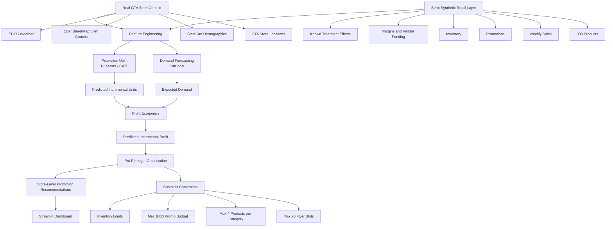
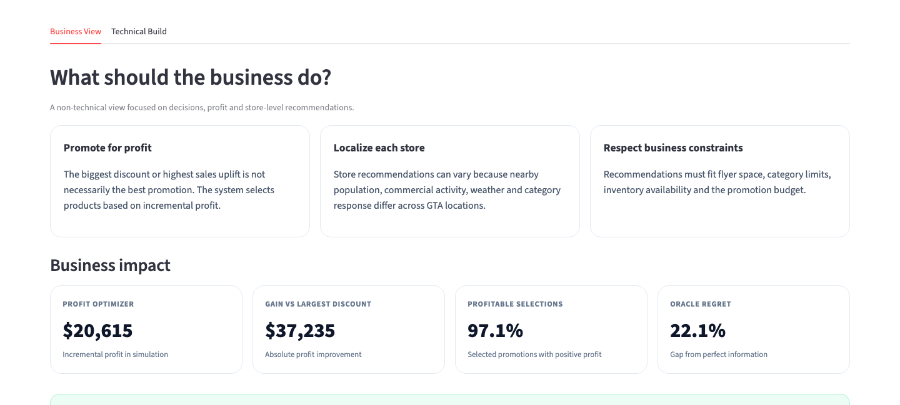
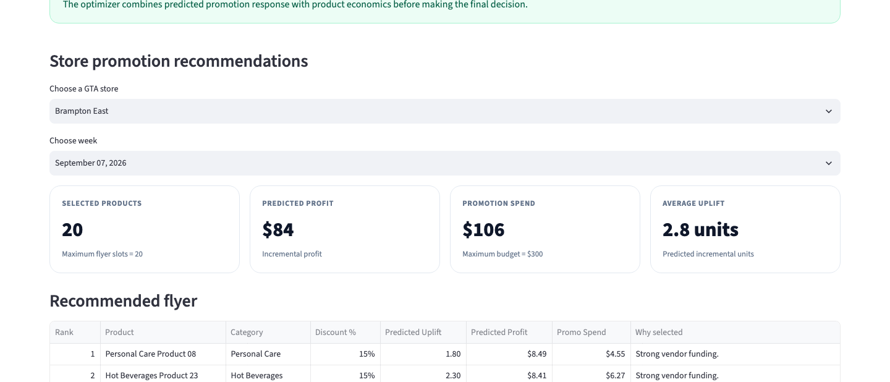
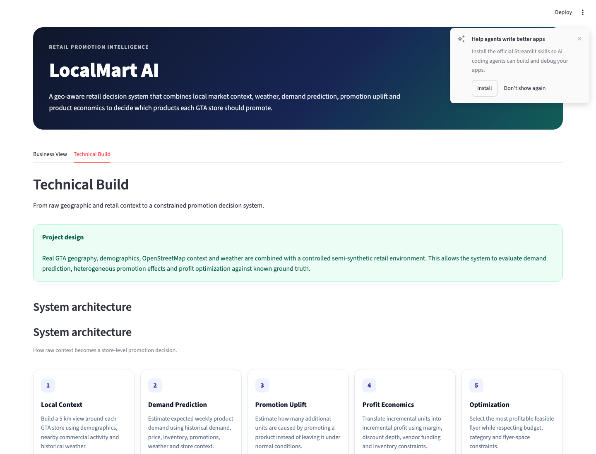

# LocalMart AI — Geo-Aware Retail Promotion Intelligence

LocalMart AI is an end-to-end retail decision system that combines **local market context, weather, demand forecasting, promotion uplift modeling, unit economics, and constrained optimization** to recommend which products each GTA store should promote.

The project is designed around a practical retail question:

> **For each GTA store and week, which products should be promoted to maximize incremental profit while respecting flyer-space, category, budget, and inventory constraints?**

## Important Project Disclaimer

The GTA store geography, Statistics Canada demographics, OpenStreetMap context, and historical weather used in this project are real.

The long-version retail environment uses a **semi-synthetic** 300-product catalog, historical sales, inventory, margins, vendor funding, promotion assignments, and treatment effects because real Walmart Canada store-level sales and experimentation outcomes are not publicly available.

Therefore:

- reported uplift and profit results evaluate the methodology in a controlled semi-synthetic environment
- reported profit is **not actual Walmart Canada profit**
- reported treatment effects are **not claims about real Walmart causal lift**
- the project should be interpreted as a portfolio decision-support system rather than a production Walmart system

## Business Problem

Retail promotion decisions should not be based only on:

- the deepest discount
- the highest predicted sales
- the largest predicted promotion uplift

A promotion can increase units sold while still reducing profit.

LocalMart AI instead combines:

**expected demand + promotion uplift + margin + discount economics + vendor funding + inventory + business constraints**

to select the most profitable feasible promotion plan.

## Business Impact

The final semi-synthetic evaluation compares four strategies:

| Strategy | Selected Products | True Incremental Profit | Avg. True Profit / Selection | Positive-Profit Rate |
|---|---:|---:|---:|---:|
| Oracle | 3,600 | $26,451.58 | $7.35 | 100.0% |
| Profit Optimizer | 3,600 | $20,615.43 | $5.73 | 97.1% |
| Highest Predicted Uplift | 3,242 | -$10,097.66 | -$3.11 | 38.7% |
| Largest Discount | 3,312 | -$16,619.31 | -$5.02 | 26.8% |

### Key results

- Demand forecasting test MAE: **3.09 units**
- Demand forecasting test RMSE: **3.94**
- Demand forecasting test WMAPE: **21.90%**
- Validation MAE improvement vs Lag-1 baseline: **29.71%**
- Uplift MAE: **0.96 incremental units**
- Uplift RMSE: **1.35**
- Uplift correlation: **0.828**
- Overall true uplift: **3.08 units**
- Top-10% true uplift: **6.67 units**
- Top-10% uplift enrichment: **2.17×**
- Profit Optimizer simulated true incremental profit: **$20,615.43**
- Oracle simulated true incremental profit: **$26,451.58**
- Oracle regret: **22.06%**
- Positive-profit optimizer selections: **97.06%**
- Absolute profit swing vs largest-discount strategy: approximately **$37.2K**

### Main business lesson

> **Highest sales uplift does not necessarily mean highest profit.**

The best promotion decision combines treatment effect with product economics and operational constraints.

## Architecture Flow



## End-to-End Decision Flow

```text
Real GTA context
+ real demographics
+ real OSM 5 km features
+ real weather
+ semi-synthetic retail history
        ↓
CatBoost demand forecasting
        ↓
T-Learner promotion uplift
        ↓
Predicted incremental units
        ↓
Profit economics
        ↓
PuLP integer optimization
        ↓
Store-specific flyer recommendations
        ↓
Streamlit dashboard
```

## Data Sources

### Real data

| Source | Use |
|---|---|
| GTA Walmart store locations | Store geography and decision units |
| OpenStreetMap | 5 km commercial, office, education, retail and transit context |
| Statistics Canada Census | Population, density, income, employment and household features |
| Environment and Climate Change Canada | Historical GTA weather context |
| M5 Forecasting dataset | Separate forecasting benchmark and modeling reference |

### Semi-synthetic retail data

The long-version evaluation creates a controlled retail environment containing:

- 15 GTA stores
- 300 products across 10 categories
- 104 weeks of store-product history
- weekly promotion assignment
- discount depth
- vendor funding
- inventory
- unit margins
- expected baseline demand
- known heterogeneous promotion effects
- simulated sales outcomes

Known ground truth makes it possible to evaluate both uplift ranking and profit optimization directly.

## Technical Approach

### 1. Geo-aware local context

Each GTA Walmart location is treated as the center of a **5 km catchment**.

Features include:

- population
- population density
- median household income
- employment rate
- average household size
- offices
- commercial and retail activity
- universities and colleges
- schools
- rail/transit context
- weather

### 2. Demand Forecasting

A CatBoost regression model predicts weekly product demand using:

- product, category and store identifiers
- lagged demand
- rolling demand statistics
- regular and promotional prices
- promotion status
- inventory
- weather
- calendar features
- local demographic and commercial context

Ground-truth treatment variables and simulated true profit are excluded from the prediction feature set.

| Metric | Result |
|---|---:|
| Test MAE | 3.090 |
| Test RMSE | 3.944 |
| Test WMAPE | 21.90% |
| Validation MAE improvement vs Lag-1 | 29.71% |

### 3. Promotion Uplift Modeling

A **T-Learner** estimates heterogeneous promotion effects with two CatBoost outcome models:

```text
Control model   → expected units without promotion
Treatment model → expected units with promotion

Predicted treatment units
-
Predicted control units
=
Predicted promotion uplift
```

Only pre-treatment and contextual features are used.

| Metric | Result |
|---|---:|
| Uplift MAE | 0.957 |
| Uplift RMSE | 1.345 |
| Correlation | 0.828 |
| Overall true uplift | 3.08 units |
| Top-10% true uplift | 6.67 units |
| Top-10% enrichment | 2.17× |

### 4. Profit-Aware Decision Layer

The system translates predicted units into economics:

```text
Control Profit
=
Predicted Control Units × Regular Unit Margin
```

```text
Promotion Profit
=
Predicted Promoted Units × Promoted Unit Margin
```

```text
Predicted Incremental Profit
=
Promotion Profit - Control Profit
```

Vendor funding and discount economics are incorporated into the promoted unit economics.

### 5. Constrained Promotion Optimization

The final promotion plan is selected with **PuLP integer programming**.

Objective:

```text
Maximize:
Σ Predicted Incremental Profit × Product Selected
```

Constraints:

- maximum **20 flyer slots** per store/week
- maximum **4 products per category**
- maximum **$300 promotion budget** per store/week
- inventory availability
- positive predicted economics for candidate promotions

Final QA showed:

- max flyer slots used: **20**
- max category count: **4**
- max promotion spend: **$298.02**

## Final Evaluation Scope

The final test evaluation contains:

- **15 stores**
- **300 products**
- **12 test weeks**
- **54,000 store-product-week uplift rows**
- **3,600 optimized promotion selections**
- test period: **2026-06-22 to 2026-09-07**

## Streamlit Dashboard

The dashboard is designed for two audiences.

### Business View

- executive recommendation summary
- store and week selectors
- optimized flyer recommendations
- predicted uplift
- predicted incremental profit
- promotion spend
- strategy comparison
- profit by store and category

### Technical Build

- data provenance
- system architecture
- demand-model evaluation
- uplift-model evaluation
- profit economics
- optimization formulation
- constraints
- limitations
- production extension

## Dashboard Screenshots

### Business Overview



### Store Recommendations



### Technical Architecture



## Repository Structure

```text
local-mart/
├── app.py
├── README.md
├── requirements.txt
├── .gitignore
├── capture_screenshots.py
│
├── docs/
│   └── images/
│
├── notebooks/
│   ├── 01.ipynb
│   ├── 02_build_enriched_sales.ipynb
│   ├── 03_eda_feature_engineering.ipynb
│   ├── 04_time_split_and_baseline.ipynb
│   ├── 05_catboost_baseline.ipynb
│   ├── 06_model_evaluation.ipynb
│   ├── 07_lightgbm_xgboost_comparison.ipynb
│   ├── 08_external_data_collection.ipynb
│   ├── 08A_prepare_statscan_profile.ipynb
│   ├── 09_statscan_demographics.ipynb
│   ├── 10_weather.ipynb
│   ├── 11_promotions_flyer_data.ipynb
│   ├── 11A_promotions_flyer_data.ipynb
│   ├── 12_build_gta_promotion_context.ipynb
│   ├── 13_promotion_opportunity_scoring.ipynb
│   ├── 14_profit_aware_flyer_optimization.ipynb
│   ├── 15_final_validation.ipynb
│   ├── 16_generate_semisynthetic_retail_history.ipynb
│   ├── 17_demand_prediction_model.ipynb
│   ├── 18_promotion_uplift_modeling.ipynb
│   ├── 19_profit_optimization_v2.ipynb
│   ├── 20_final_long_version_evaluation.ipynb
│   └── results/
│
├── results/
└── data/              # large/raw local datasets are ignored
```

## How to Run Locally

Python 3.11 is recommended.

### 1. Clone

```bash
git clone https://github.com/htoor2026/local-mart.git
cd local-mart
```

### 2. Create the environment

```bash
conda create -n retail-ai python=3.11 -y
conda activate retail-ai
```

### 3. Install dashboard dependencies

```bash
pip install -r requirements.txt
```

### 4. Run the dashboard

```bash
python -m streamlit run app.py
```

Then open:

```text
http://localhost:8501
```

## Dashboard Dependencies

The deployed dashboard uses:

- Streamlit
- pandas
- NumPy
- PyArrow
- Plotly

Training notebooks additionally use tools such as CatBoost, LightGBM, XGBoost, scikit-learn, PuLP, DuckDB, MongoDB/PyMongo, GeoPandas, and OSMnx.

## Limitations

- Real Walmart Canada store-level sales outcomes are not publicly available.
- Product sales, margins, inventory and treatment effects in the long-version evaluation are semi-synthetic.
- Reported simulated profit is not actual Walmart Canada profit.
- Pearson-area weather is used as a GTA-wide weather proxy.
- The T-Learner is a baseline heterogeneous-treatment estimator.
- Optimization results depend on the quality of modeled economics and business constraints.
- A real production system would require live POS sales, inventory, pricing, promotion history, vendor funding and experimentation outcomes.

## Future Production Extension

```text
Live Retail Data
        ↓
Validated Feature Pipeline
        ↓
Demand Model
        ↓
Uplift / Causal Model
        ↓
Profit Engine
        ↓
Optimization Service
        ↓
Decision Dashboard
        ↓
Monitoring + Drift Detection
        ↓
Retraining
```

Potential extensions include:

- FastAPI serving
- MLflow experiment tracking and model registry
- Docker
- scheduled ingestion
- data validation
- drift monitoring
- automated retraining
- CI/CD
- cloud deployment
- stronger causal estimators such as X-Learner, doubly robust methods or causal forests

## Project Takeaway

This project is designed to show that a data scientist should not stop at model accuracy.

> **Predict demand → estimate treatment effect → translate it into economics → optimize under business constraints → communicate the recommendation clearly.**
