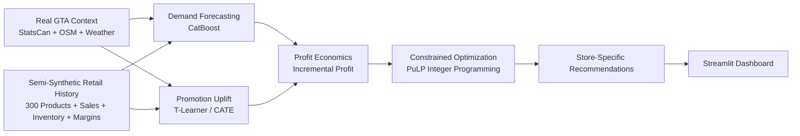

LocalMart AI — Geo-Aware Retail Promotion Intelligence
Portfolio project: a store-level retail decision system that combines local 5 km context, weather, demand forecasting, promotion uplift modeling, product economics, and constrained optimization to recommend which products each GTA store should promote.

Important Project Disclaimer
The GTA store geography, Statistics Canada demographics, OpenStreetMap context, and historical weather are real.
The long-version retail environment uses a semi-synthetic 300-product catalog, historical sales, inventory, margins, vendor funding, promotion assignments, and treatment effects because real Walmart Canada store-level sales and experiment outcomes are not publicly available.
Therefore, the reported uplift and profit results evaluate the decision methodology in a controlled semi-synthetic environment. They are not claims about actual Walmart Canada sales, causal lift, or profit.
Business Problem
Retail promotion decisions should not be based only on the deepest discount, the highest expected sales, or the highest promotion uplift. A promotion can increase units sold while still destroying margin.
LocalMart AI asks:
For each GTA store and week, which products should be promoted to maximize incremental profit while respecting flyer-space, category, budget, and inventory constraints?

Business Impact
The final evaluation compares four promotion strategies in the semi-synthetic environment:
Strategy	Selected Products	True Incremental Profit	Avg. True Profit / Selection	Positive-Profit Rate
Oracle	3,600	$26,451.58	$7.35	100.0%
Profit Optimizer	3,600	$20,615.43	$5.73	97.1%
Highest Predicted Uplift	3,242	-$10,097.66	-$3.11	38.7%
Largest Discount	3,312	-$16,619.31	-$5.02	26.8%

Key results
- Demand forecasting MAE improved by 29.7% over a Lag-1 validation baseline.
- CatBoost test performance: MAE 3.09, RMSE 3.94, WMAPE 21.90%.
- Promotion uplift model: MAE 0.96, RMSE 1.35, correlation 0.828.
- Top 10% predicted promotion opportunities achieved 6.67 true incremental units versus 3.08 overall, a 2.17× enrichment.
- Profit Optimizer achieved $20,615.43 in simulated true incremental profit.
- 97.1% of optimizer selections were profitable.
- Oracle regret was 22.1%.
- Relative to the largest-discount strategy, the optimizer created an absolute simulated profit swing of approximately $37.2K.
Main business lesson
Highest sales uplift does not necessarily mean highest profit.

The best promotion decision combines expected treatment effect with margin, discount depth, vendor funding, inventory, and operating constraints.
System Architecture

Local store context
        ↓
Expected product demand
        ↓
Expected promotion uplift
        ↓
Incremental units
        ↓
Incremental profit
        ↓
Business constraints
        ↓
Optimized store-level promotion plan
Data Sources
Real data
Source	Use
GTA Walmart store locations	Store geography and store-level decision units
OpenStreetMap	5 km commercial, office, school, university, retail, and transit context
Statistics Canada Census	Population, income, employment, household, and density features
Environment and Climate Change Canada	Historical GTA weather context
M5 Forecasting dataset	Separate forecasting benchmark and modeling reference

Semi-synthetic data
The long-version evaluation creates a controlled retail environment containing:
- 300 products across 10 categories
- weekly product-store history
- promotion assignment and discount depth
- vendor funding
- inventory
- unit margins
- baseline expected demand
- known true heterogeneous promotion effects
- simulated sales outcomes
This provides known ground truth for uplift and optimization evaluation.
Technical Approach
1. Geo-aware local context
Each GTA Walmart location is treated as the center of a 5 km catchment area. Features include population, density, median household income, employment, household size, offices, commercial/retail activity, universities/colleges, schools, transit context, and weather.
2. Demand Forecasting
A CatBoost regression model predicts weekly product demand using lagged demand, rolling means, store/product/category identifiers, price, promotion, inventory, weather, calendar features, and local 5 km context.
Leakage variables such as known true uplift and simulated true profit are excluded.
Metric	Result
Test MAE	3.090
Test RMSE	3.944
Test WMAPE	21.90%
Validation MAE improvement vs Lag-1	29.7%

3. Promotion Uplift Modeling
A T-Learner estimates heterogeneous treatment effects using two CatBoost outcome models:
Control model → expected units without promotion
Treatment model → expected units with promotion

Treatment prediction - Control prediction = Predicted promotion uplift
Only pre-treatment/context features are used.
Metric	Result
Uplift MAE	0.957
Uplift RMSE	1.345
Correlation	0.828
Overall true uplift	3.08 units
Top-10% true uplift	6.67 units
Top-10% enrichment	2.17×

4. Profit-Aware Decision Layer
Control profit = predicted control units × regular unit margin
Promotion profit = predicted promoted units × promoted unit margin
Predicted incremental profit = promotion profit - control profit
Vendor funding and discount economics are incorporated into promoted unit cost.
5. Constrained Promotion Optimization
The final plan is selected with integer programming using PuLP.
Objective:
Maximize Σ Predicted Incremental Profit × Product Selected
Constraints:
- maximum 20 flyer slots per store/week
- maximum 4 products per category
- maximum $300 promotion budget per store/week
- inventory availability
- positive predicted economics for candidate promotions
Observed final constraints passed:
- max flyer slots: 20
- max category count: 4
- max promotion spend: $298.02
Streamlit Dashboard
The dashboard is designed for two audiences.
Business View
- executive recommendation summary
- store and week selectors
- optimized flyer
- predicted uplift and incremental profit
- promotion spend and business rationale
- strategy comparison
- profit by store/category
Technical Build
- data provenance
- end-to-end architecture
- demand model and evaluation
- uplift model and evaluation
- profit economics
- optimization formulation and constraints
- limitations and production extension
Dashboard Screenshots
Save final clean screenshots under docs/images/ using these names.
Business overview
 
Store recommendations
 
Technical architecture
 
Uplift evaluation
 
Strategy comparison
 
Repository Structure
retail-promotion-intelligence/
│
├── app.py
├── README.md
├── requirements.txt
├── .gitignore
│
├── notebooks/
│   ├── 02_build_enriched_sales.ipynb
│   ├── 03_eda_feature_engineering.ipynb
│   ├── 04_time_split_and_baseline.ipynb
│   ├── 05_catboost_baseline.ipynb
│   ├── 06_model_evaluation.ipynb
│   ├── 07_lightgbm_xgboost_comparison.ipynb
│   ├── 08_external_data_collection.ipynb
│   ├── 08A_prepare_statscan_profile.ipynb
│   ├── 09_statscan_demographics.ipynb
│   ├── 10_weather.ipynb
│   ├── 11_promotions_flyer_data.ipynb
│   ├── 11A_promotions_flyer_data.ipynb
│   ├── 12_build_gta_promotion_context.ipynb
│   ├── 13_promotion_opportunity_scoring.ipynb
│   ├── 14_profit_aware_flyer_optimization.ipynb
│   ├── 15_final_validation.ipynb
│   ├── 16_generate_semisynthetic_retail_history.ipynb
│   ├── 17_demand_prediction_model.ipynb
│   ├── 18_promotion_uplift_modeling.ipynb
│   ├── 19_profit_optimization_v2.ipynb
│   └── 20_final_long_version_evaluation.ipynb
│
├── results/
│   └── selected lightweight final outputs
│
├── models/
├── docs/images/
└── data/                 # ignored local datasets
For the public repo, keep final lightweight outputs under one root results/ folder even if your current local notebooks generated some files under notebooks/results/.
How to Run Locally
1. Clone
git clone https://github.com/htoor2026/walmart.git
cd walmart
2. Create environment
conda create -n retail-ai python=3.11 -y
conda activate retail-ai
3. Install dependencies
pip install -r requirements.txt
4. Run Streamlit
python -m streamlit run app.py
Open http://localhost:8501.
Key Technologies
Python, pandas, NumPy, CatBoost, LightGBM, XGBoost, scikit-learn, PuLP, Streamlit, Plotly, DuckDB, MongoDB, GeoPandas, OSMnx, Statistics Canada Census, Environment and Climate Change Canada weather, Parquet/PyArrow.
Limitations
- Real Walmart Canada store-level sales outcomes are not publicly available.
- Long-version sales, margins, inventory, and treatment effects are semi-synthetic.
- Reported simulated profit is not actual Walmart Canada profit.
- Pearson-area weather is used as a GTA-wide proxy.
- The T-Learner is a baseline heterogeneous-treatment estimator.
- The optimization assumes modeled economics and constraints are correctly specified.
- Real deployment would require live POS sales, inventory, pricing, promotion history, vendor funding, and experiment outcomes.
Future Production Extension
Live Retail Data
        ↓
Validated Feature Pipeline
        ↓
Demand Model
        ↓
Uplift / Causal Model
        ↓
Profit Engine
        ↓
Optimization Service
        ↓
Decision Dashboard
        ↓
Monitoring + Drift Detection
        ↓
Retraining
Potential additions: FastAPI, MLflow, Docker, scheduled ingestion, data validation, drift monitoring, automated retraining, CI/CD, and cloud deployment.
Project Takeaway
This project is designed to show that a data scientist should not stop at model accuracy.
Predict demand → estimate treatment effect → translate it into economics → optimize under business constraints → communicate the recommendation clearly.